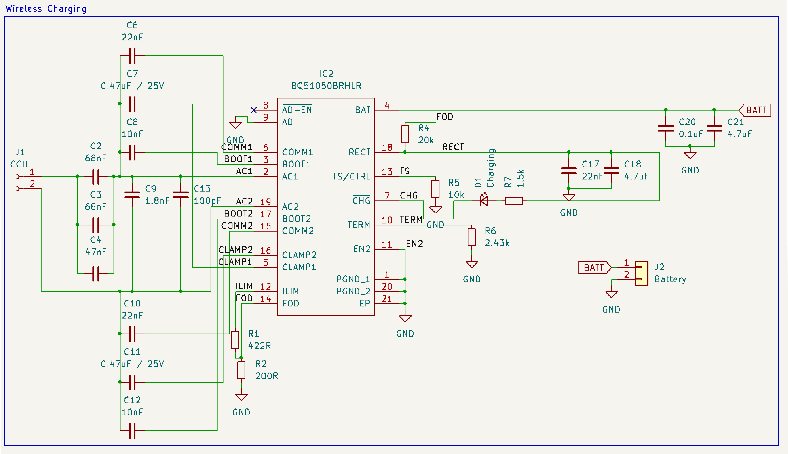
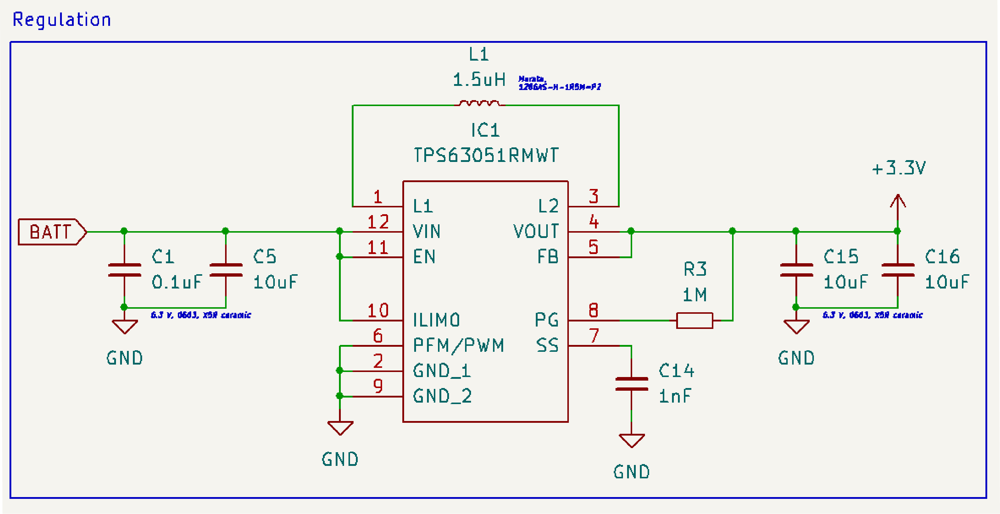
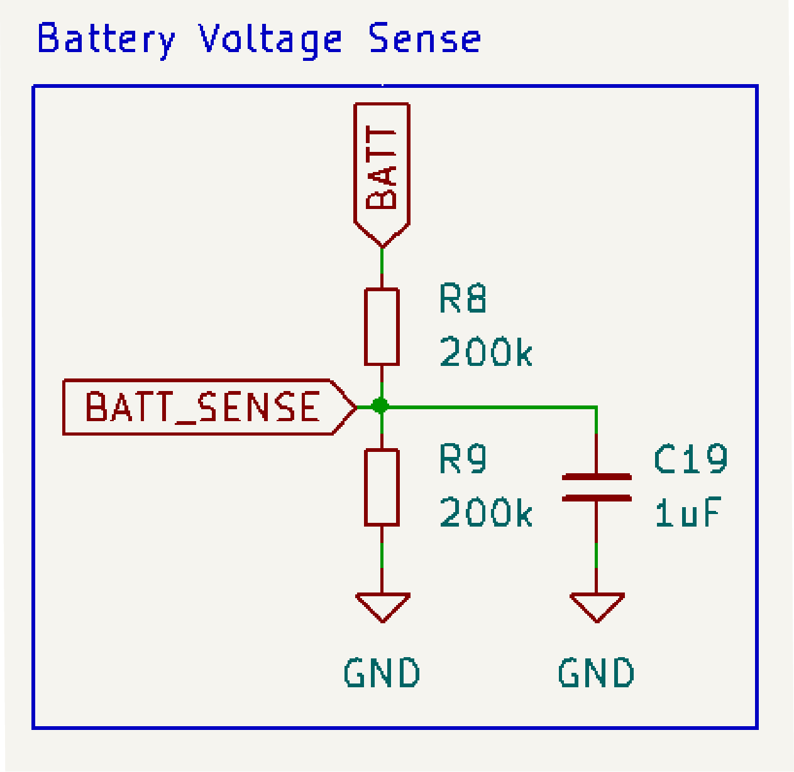

+++
title = 'F91W Log 1'
date = 2024-10-28T11:29:00
summary = "Working on the power circuitry of a re-designed Casio F91W, now with wireless charging. "
showSummary = true
categories = ["Blog",]
tags = ["hardware","open-source"]
+++
# Introduction
This project has been a long time in the making. To be honest, I haven't dedicated to it nearly enough time - things have been quite hectic in the last year or so.

Anyway, I'm here to formalise the development and show what works, so far.

This project is in collaboration with the [Near Future Laboratory](https://nearfuturelaboratory.com/) - special thanks go to Julian Bleecker, Camille MacRae, Cristina Lopes, Dre Labre and Tiffany Hon for their input.

## The Project
The project is relatively simple: _what is the future of timekeeping?_

We got inspiration from the [F91 Kepler](https://gitlab.com/_Pegor/kepler_fw) watch, a modern re-interpretation of the venerable Casio F91W. Yes, _that_ Casio watch, famous for its iconic, minimalist design and legendary durability. The Casio F91W, launched in 1989, has achieved cult status for its reliability, affordability, and distinctive style - so distinctive that you might [get flagged at the airport for "screening" if you're wearing it.](https://www.watchesofespionage.com/blogs/woe-dispatch/casio-f-91w-the-preferred-watch-of-terrorists)

## What Makes the F91W Special
The F91W is not only beloved for its utilitarian design but also its symbolic weight. It’s seen as a democratised piece of tech, accessible to nearly anyone while embodying a time-honored, straightforward approach to design. It features simple alarm and stopwatch functions, a 24-hour clock, and, perhaps surprisingly, an impressive battery life of up to seven years. Have I mentioned it's waterproof too? As a cherry on top, it's priced fairly consistently at 10 _local currencies_ across the world.

It's cheap, gorgeous, compact and a design icon. How can we update it?

## Enter the Kepler Project
The [F91 Kepler](https://gitlab.com/_Pegor/kepler_fw) reimagines this classic timepiece for the era of smart-_everything_. Led by designer [Pegor Karoglanian](https://gitlab.com/_Pegor), the project maintains the spirit of the original F91W while integrating modern features and functionality. Kepler enhances the classic watch by incorporating contemporary technology, such as customisable firmware, Bluetooth connectivity, and the option of adding modern sensors via a small daughterboard. It also uses a gourgeous display. I mean, _look at that thing_.



## Our Interpretation
The Kepler looks amazing. We definitely want to keep an updated screen, preferrably OLED and ideally RGB. We do not want to have, though, sensors and Bluetooth connectivity. It should keep its essence - a dumb, functional, beautiful watch. With the updated screen, though, we can play around with new UIs and ways of showing how time passes.

Should we show time as a countdown? Should it be relative and unique to each wearer? Are numbers the best way to show time? What about shapes and colours?

So many questions, but before we get there, we need a proof of concept.

Cue my preferred ECAD software - [Kicad](https://www.kicad.org/).

### Overview
From a high level overview, there are not so many components to a watch:




We need a modern screen. This is not exactly trivial, as modern screens (i.e., OLEDs or similar) draw several orders of magnitude more power than old-school, power-sippin' displays. A problem for another time.



Some way to receive wearer input to e.g., set up the time or snooze an alarm. The OG F91W has three buttons, we're aiming to keep the same configuration. We still need a low-power microcontroller to read the interrupts and drive the screen.



We need to power the watch. A standard lithium-polymer battery operates between 4.2v and 3.5-ish v, while we need (probably) a 3.3v source for the microcontroller and the screen. We could use a LDO, but it'd be inefficient. 



How the watch ticks (pun intended). Ideally it would be in an accessible format, i.e., in a standard .ino format, so that anybody with the watch could reprogram it on the fly.




Today's post focuses on the power section.

### Unlimited Power
The F91W uses disposable coin-cell batteries, like this one:


The CR2032 (and other similar coin cell batteries) have a very limited capacity, but are very stable and have low self-discharge. That's all well and good, but common coin cell batteries are rated at ~200 mAh ([e.g., this Energizer datasheet](https://data.energizer.com/pdfs/cr2032.pdf)). Not good enough.

We could use rechargeable coin cells, such as the LIR2032. Only problem: these are only rated at ~40 mAh ([source](https://uk.rs-online.com/web/p/button-batteries/1834291)). 

Ok then, whack in a LiPo battery with associated charging circuitry, a nice little USB connector and you're good to go. Well, not really either. I am a fan of Casio's design and don't what to interrupt it with a USB socket. the watch wound loose it watertight-ness too, which is not ideal. So what to do?

### Wireless Charging
Would be the ideal solution. Downside: I've never designed a wireless charger. Reference design to the rescue! Cue in the **bq5105xB High-Efficiency Qi v1.2-Compliant Wireless Power Receiver
and Battery Charger**.

That's a mouthful, but it's not terribly complicated. It's an integrated circuit (IC) that uses a standard wireless protocol - Qi - to charge a battery. As a bonus, it comes in a (relatively) easy to hand solder package, if you have a hot air rework station at hand. Together with the [TPS63051](https://www.ti.com/product/TPS63051) buck-boost converter, we should have a stable, low-quiescent (43µA), 1A / 3.3v power rail for the watch.




The schematic I've come up with is a bog-standard replication of the suggested schematics. I've added a simple resistor divider and decoupling capacitor for voltage sensing (i.e., to figure out when to charge the watch). It's not the most efficient way to do so, as there are dedicated fuel gauge ICs for this very application, but at this stage it makes sense to keep the BOM small and to have less points of failure in the prototype. 


  
  
  


The layout, again, simply follows the guidelines in the relevant datasheet. It's a four-layer design, manufactured by [JLCPCB](https://jlcpcb.com/) (I'm not affiliated with them in any way, but I've used them many times before and their quality/price is fantastic).




I've soldered up a couple boards and it all works fine. I'll spin up a GitHub repo when I have the time.