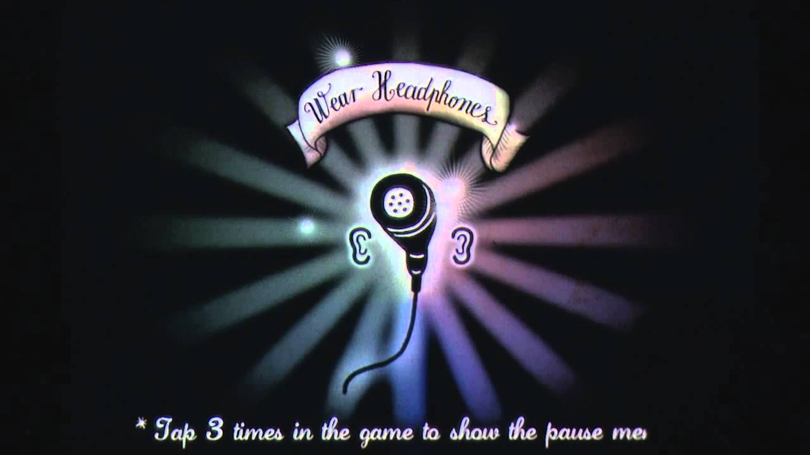
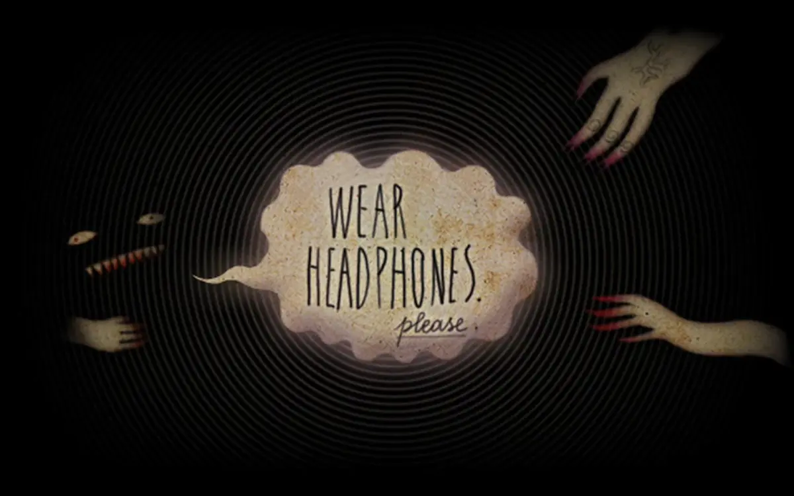

+++
title = 'On Fading Magic'
date = 2026-02-08T19:26:00
summary = "On how sufficiently advanced technology stops being magic once we understand it, and why moving our understaning from magic to mundane matters."
showSummary = true
categories = ["Blog",]
tags = ["technology", "design philosophy", "politics"]
+++

Arthur C. Clarke's third law - [that any sufficiently advanced technology is indistinguishable from magic](https://www.goodreads.com/book/show/169258.Profiles_of_the_Future) - has become one of those quotes that gets regularly waved about at tech conferences and TEDx talks. Usually it's deployed as a celebration, a snotty and triumphalist declaration that we live in magical times. But like most aphorisms that get co-opted by the innovation class, it's missing something essential. In this case, a temporal dimension. Clarke's observation is true only at a specific moment for a specific observer. And that moment passes, _the magic fades_. 

I'm not going to touch on Clarke's first two laws here - they deserve their own unpacking, ideally one that's less ageist and more honest about institutional gatekeeping. But this third one, the magic one, needs reconsideration. Because what Clarke identified as a categorical statement is actually describing a process, a transition from the _mystical_ to the _mundane_. And understanding that process tells us something essential about how technologies actually become useful rather than merely impressive.

Let me take you back to a specific moment of personal technological enchantment. I got my hands on fourth-generation (I think- either that or the 3rd Gen one) iPod Touch. This was peak 2010s gadget worship, when Apple could still make you feel like you'd joined a priesthood just by purchasing their products. But what really captured me wasn't the device itself; it was a game called Papa Sangre.

The premise was simple (and pardon me if I don’t get all the nuance right, it’s been a while): tap two (skeleton-foot-shaped) buttons alternately to walk forward through a level, following a shrill bell while avoiding a sleeping monster. If you went too close to it or, heavens forbid, you'd trip on it, it would awake and start stomping towards you. Then all was left for you was to smash the buttons as fast as you could to run away.

Fond memories aside, the whole game had no visual assets besides the UI. It was incredibly immersive and terrifying, and even though I am little more than a casual gamer, it really stuck with me as one of the most exciting gaming experiences of my life. And yes, it felt like magic, like some arcane ritual had been performed to make sound behave this way, to create a three-dimensional space you could navigate with your ears. The technology was sufficiently advanced that I couldn't distinguish it from the supernatural.


  
  
  
  
  


  Screen grabs from Papa Sangre. There's not a ton of images out there...


But here's the thing about magic: it demands to be understood (at least if you, like me, are fans of Penn and Teller’s philosophy). That experience metastasised into curiosity, then into study, and eventually into a significant portion of my PhD practice. I built an audio-only immersive experience where, instead of tapping Gorilla Glass, you could freely move through physical space, tracked in real-time with centimetre-level accuracy via Ultra Wideband technology. The same tech that's now in AirTags and helps you find your misplaced iPhone.

And in that process of building, the magic dissolved into comprehension. Head-related transfer functions. Gaze tracking. Position tracking. Trigger events. The whole technical apparatus revealed itself. Spatial audio went from mystical to mundane, not because it lost its appeal (I still absolutely adore these experiences, rare as they are), but because it became one of my tools to wield (yes, it's bombastic language, but bear with me).

This is my interpretation of the trajectory Clarke was actually describing: sufficiently advanced technology is indistinguishable from magic _until it isn't_. The transformation from mystical to mundane is how technology actually diffuses, how it moves from the realm of the impressive demo to the toolkit of practical application.

Now, I'm not claiming spatial audio was universally magical when Papa Sangre launched. Obviously, some engineers were wrestling with those very head-related transfer functions to get the thing into the App Store. Magic is observer-relative. What's alien to me might be Tuesday afternoon for someone else. But that relativity is precisely what makes the fading of magic so important as a social and technical process.

Which brings me, inevitably, to our current moment of technological mysticism: AI and robotics. If you don't know (at least, cursorily) what vector spaces, tokens, layers, and parameters are, you'd be absolutely correct in assuming that "we made sand think!". Similarly, if you've never encountered genetic algorithms, embodied computation, or subsumption architecture, watching a humanoid robot perform a backflip looks like some arcane sorcery holds it together. (Though, to be fair, RF design actually _is_ magic, complete with copper runes etched into boards that function as three-dimensional components when excited at precisely the right frequency. But I digress.)



I'm not claiming to understand everything happening in these fields. But it's part of my job to stay abreast of these developments, to keep the magic from settling into bright-eyed ignorance. And here's where I want to push back against a certain kind of technological discourse that's become dominant: the one that profits from maintaining the mystical framing, from keeping technology sufficiently advanced that it remains indistinguishable from magic for as long as possible.

Because demystification threatens certain interests. If AI remains magical, if it's just "emergent intelligence" or "neural networks that think like brains" (don't get me started, I'll rant nonstop about brain-body dualism and how it doesn't work), then you don't ask inconvenient questions about training data provenance, about whose labour went into labelling those millions of images, about the actual limits and failure modes of statistical pattern matching. You don't wonder about energy consumption or water usage or the material conditions of compute infrastructure. You just marvel at the sleight of hand.

The same pattern holds for robotics. Keep it sufficiently advanced, sufficiently _other_, and you can sell the narrative of inevitable displacement, of workers being replaced by tireless mechanical servants. The magic obscures the material reality: these systems are brittle, context-dependent, and require extensive human scaffolding to function. But that's a less compelling story than _look at my OpenClaw automation that will replace humans_.

{{< figure
    src="moltclawopen.jpg"
    alt="Meme showing three lobsters pointing at each other"
    caption="I'm not entering the whole ClawBot / MoltBot / OpenClaw debacle, but I did enjoy the memes. If I were to proffer an opinion, I'd just point out it's a security nightmare and one should NEVER use it. [Cisco](https://blogs.cisco.com/ai/personal-ai-agents-like-openclaw-are-a-security-nightmare), [1Password](https://1password.com/blog/from-magic-to-malware-how-openclaws-agent-skills-become-an-attack-surface) and even [the moltBots themsevles](https://www.moltbook.com/post/cbd6474f-8478-4894-95f1-7b104a73bcd5) are all in agreement."
    >}}

The fading of magic is a political act. When technology becomes mundane, when the mechanisms are exposed and understood, it becomes possible to ask who benefits, who decides, and who gets excluded. It becomes possible to intervene, to shape, to resist. Technologies aren't neutral tools that descend from the heavens; they're social relations materialised in silicon, ceramic and steel. And you can't challenge social relations you don't understand.

This might sound like a variation on "technology X is a solution in search of a problem", and there's some overlap. But I'm making a subtly different point. You don't find solutions growing between cracks in the pavement. You don't stumble upon applications fully formed. Instead, you build and interact and effervesce in a loop of exploration and sense-making until the magic fades enough that you can actually _use_ the thing.

The most transformative applications of any technology emerge not in its magical phase, when it's sufficiently advanced to inspire awe, but in its mundane phase, when it's well understood enough to be repurposed, hacked, and combined with other now-mundane technologies in unexpected ways. The internet wasn't revolutionary because of TCP/IP (well, it was - Internet protocols are a whole other rabbit hole, but you get my point); it was revolutionary when those protocols faded into the background, and people started building weird, unglamorous, specific applications on top of them. Flash games anyone?

I think AI and robotics can only become truly mainstream (and by mainstream, I mean actually useful beyond marketing hype and venture capital pitch decks) when the magic fades. When these technologies become boring enough that we stop talking about "artificial intelligence" as though it's a monolithic entity and start talking about specific algorithmic approaches with specific affordances and limitations. When we can open the black box without it shattering the illusion, _because the illusion is no longer necessary to the value proposition_.

This is, admittedly, in tension with how capital prefers to deploy technology. There's more money in magic than in mundanity. The mystique justifies premium pricing, attracts investment, and shores up monopoly positions. Demystification threatens that arrangement. Which is why so much technical communication is deliberately obscurantist, wrapped in jargon that mystifies rather than explains, that maintains the priestly class of those who understand versus those who merely use.

But if you ascribe to any sort of technological determinism, then the fading is inevitable. Magic can't sustain itself indefinitely. Eventually, enough people poke at the edges, enough Packt books are written, enough open-source implementations get shared (or, in today's world, _scraped_). The curtain gets pulled back not through any grand revelation but through the accumulated efforts of thousands of people trying to actually _do_ things with the technology.

And when that happens, when the magic finally fades into tool, that's when things get interesting. The magic was just a temporary state before understanding, and understanding, unglamorous as it is, is where the real work begins.