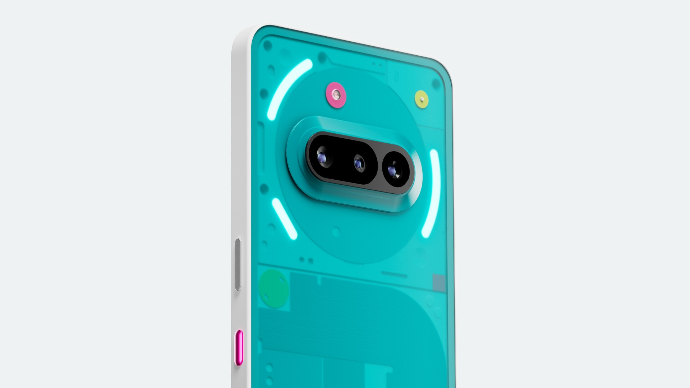
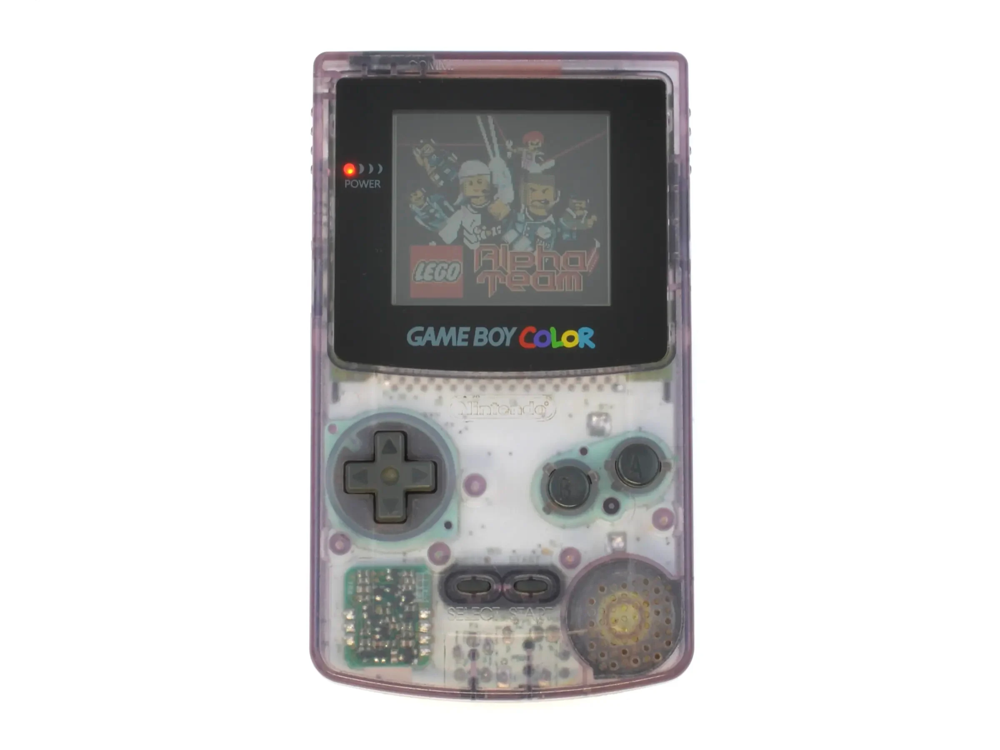
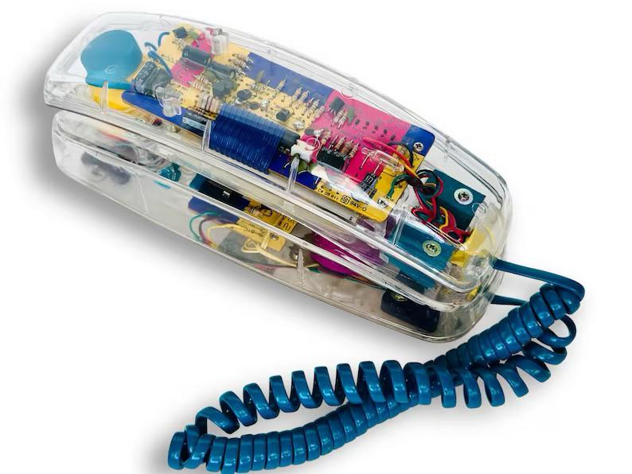
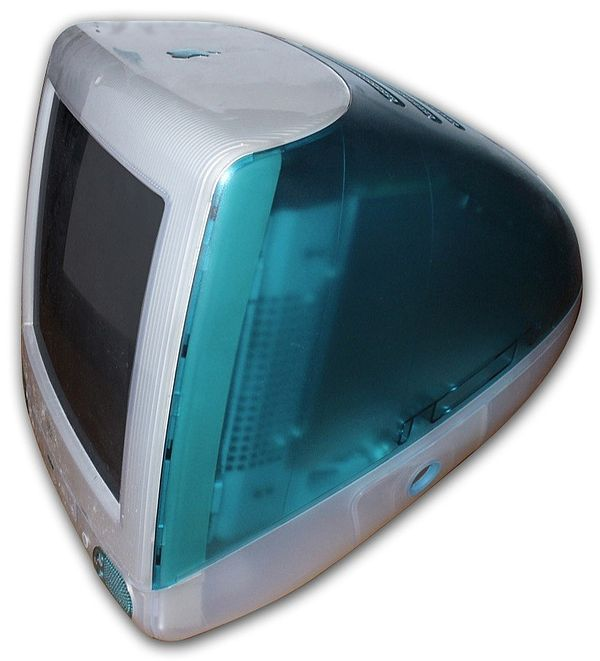

+++
title = 'On Nostalgia'
date = 2026-02-01T19:29:00
summary = "Mark Carney says nostalgia isn't a strategy, but we're all drowning in it anyway - from transparent phones to deglobalised supply chains. A personal reflection on why we can't stop looking backward when the present feels unbearable, and why it won't save us."
showSummary = true
categories = ["Blog",]
tags = ["design", "politics", "economics", "strategy", "technology", "supply chains", "international relations"]
+++

I've been thinking about Mark Carney's Davos speech - you know the one where he says nostalgia isn't a strategy - and I can't stop mulling over that phrase. Partly because he's right, obviously. But also because I'm absolutely drowning in nostalgia these days, and I suspect I'm not alone. [(Here's the transcript, FWIW)](https://www.weforum.org/stories/2026/01/davos-2026-special-address-by-mark-carney-prime-minister-of-canada/).

It started small. The eye twitch won't go away (I should probably stop drinking coffee, but let's be honest, that's not happening. And tea simply isn't the same, sorry). More responsibilities. The general low-level hum of anxiety that I'm pretty sure didn't exist in my twenties, or if it did, I was too busy to notice. So naturally, my brain does what brains do when confronted with an uncomfortable present: it starts rummaging through the past looking for bits that felt somehow better.

The neuroscience here is interesting - though not in the way I initially thought. Turns out bad memories stick *better* than good ones, at least initially. That 2001 paper everyone cites is literally called ["Bad is stronger than good"](https://journals.sagepub.com/doi/10.1037/1089-2680.5.4.323). But that's only part of the story: the emotional sting fades faster from negative memories than positive ones, leaving you with what Mitchell and colleagues call ["rosy view"](https://www.sciencedirect.com/science/article/abs/pii/S0022103197913330). Your brain doesn't remember the past accurately, rather, it systematically edits out the bad bits and enhances the good ones. And this effect gets stronger over time, like a lossy compression algorithm that keeps throwing away data you might have actually needed. 

I didn't expect that this [positive memory bias is actually correlated with mental health](https://pmc.ncbi.nlm.nih.gov/articles/PMC6921927/). Depression is partly characterised by its *absence*. So we're all walking around with slightly corrupted memory banks, and that corruption is what keeps us functional. Great.
## The transparent plastic problem

Nothing released their [Phone (3a) Community Edition](https://nothing.tech/products/phone-3a-community-edition?Capacity=12%2B256+GB) in December - 1,000 units, translucent frosted glass, explicitly marketed as "inspired by 90s tech". I saw it and felt something embarrassingly close to longing. Transparent electronics! Like my (coveted, but never had) childhood Game Boy, like those ridiculous see-through landline phones, like every Super Nintendo shell on eBay that I definitely don't need but keep looking at anyway. And don't get me started on the iMac G3.


  
  
  
  
  



I was around transparent tech in the 90s, and you know what? Most of it was plastic crap that yellowed and cracked over time. The iMac was beautiful, but ran like a dog if you tried to do anything actually useful with it. Further, it was transparent because injection-moulded clear plastic was cheap without _feeling_ cheap [as Leander Kahney explains in his book](https://www.goodreads.com/book/show/17707768-jony-ive), not because it represented some golden age of design honesty.

But Nothing isn't selling me a phone. They're selling me the *feeling* of a time when - in my selectively edited memory - tech was optimistic and legible and you could actually see how things worked. Never mind that modern electronics are so complex that making them transparent just shows you a meaningless sandwich of black rectangles. The transparency is purely aesthetic, purely nostalgic, and I want one anyway.

I despise how nostalgia is being instrumentalised. It takes something that once meant something (90s design language that said "look, no secrets, you can understand this"), strips out everything that made it meaningful (actual legibility, repairability, simplicity), and sells it back as a limited-edition commodity. They made 1,000 units. You can't even buy the feeling of the 90s anymore - you have to get on a waitlist for it.
## When corporations get nostalgic

[80% of millennials and Gen Z are apparently drawn to brands using nostalgia, and 92% of consumers find nostalgic advertising more relatable.](https://blog.emb.global/rise-of-nostalgia-marketing/#:~:text=Key%20Takeaways,enhance%20brand%20loyalty%20and%20relatability.) These numbers make me want to lie down in a dark room.

But corporations aren't stupid. They're not selling the past; they're selling what one Molly Gabris calls ["newstalgia"](https://www.adweek.com/partner-articles/newstalgia-throwbacks-and-other-tactics-to-tug-at-gen-zs-heartstrings/) - mixing references from different decades to evoke emotion rather than strict historical accuracy. It's nostalgia as a processed food, with all the historical specificity stripped out and replaced with a vague sense of "remember when things felt better?"

And things *do* feel worse, materially. We've created an economic system that produces abundance while somehow making everyone feel more precarious. Housing costs are insane. Real wages are stagnant. So corporations sell us transparent phones, retro typewriter keyboards, and whatever other aesthetic signifiers of a time when, supposedly, things made sense. To quote directly (I'll hold personal judgement):
> ["The brands that evoke nostalgia are selling more than just products; they offer comfort, connection and continuity during periods of unrest".](https://www.quirks.com/articles/why-nostalgia-is-the-hottest-strategy-for-brands-right-now)

Which is a polite way of saying: things are bad now, so here's a branded memory of when they weren't, that'll be £599 plus VAT (ok maybe some personal judgement is seeping through).
## The supply chain tells a different story

Meanwhile, the actual material substrate of global capitalism is busy having its own nostalgia crisis, except it's not calling it that.

[Global trade is down 8 percentage points from 2008 and never recovered](https://www.oliverwyman.com/our-expertise/insights/2022/oct/how-the-world-got-bigger-again.html?bsrc=oliverwyman). [China's share of trade in its own economy dropped from 64% to 37%](https://ourworldindata.org/data-insights/trade-plays-a-much-smaller-role-in-chinas-economy-than-it-did-a-few-decades-ago). [Oliver Wyman's surveys](https://gfu.de/wp-content/uploads/2022/09/The-way-back-home.pdf) across France, Germany, India, and even the US show people think "the world is too globalised". Companies are "reshoring," "nearshoring," "friendshoring" - pick your prefix, they're all trying to stuff supply chains back into boxes they exploded out of decades ago.

This is nostalgia too, just the less translucent kind. It's nostalgia for when you made things close to where you sold them, when trade meant something comprehensible rather than global just-in-time logistics orchestrated (mostly) by container ships.

Except you can't actually go back. The expertise is gone. The infrastructure is gone. The workers who knew how to do it retired, died or were made redundant twenty years ago. You can bring manufacturing back to Poland or Mexico or Vietnam (or the UK!), but you're not bringing back the supply chains of 1985 any more than Nothing is bringing back the iMac.

And yet [65% of Americans buying electronics now focus on domestic brands, 74% on locally produced devices](https://www.corporate.marsh.com/insights/publications/2023/march/supply-chain-strategies-are-likely-to-lead-to-more-deglobalization.html). We want the comfort of local, the imagined security of "made here," even though "here" barely manufactures anything anymore and probably can't afford to start again at any scale that matters. 
## What Carney actually said

Mark Carney's speech was remarkable for actually naming this problem. "The strong do what they can and the weak suffer what they must", he said - which is just [Thucydides](https://www.thelatinlibrary.com/imperialism/readings/thucydides8.html), but it hits different when the Prime Minister of Canada is saying it at Davos.

His whole speech was this weird elegy for the rules-based international order, except he wasn't mourning it; he was trying to figure out what comes after. "Great powers have begun using economic integration as weapons, tariffs as leverage, financial infrastructure as coercion, supply chains as vulnerabilities to be exploited". Trump is threatening to annex Canada and seize Greenland. The EU and everyone else are trying to pretend this is temporary, that they can "manage" POTUS, that the old system will come back if they're just patient.

Carney's saying that it simply won't. "We know the old order is not coming back. We shouldn't mourn it. *Nostalgia is not a strategy*".

His solution - "variable geometry", or, forming different coalitions for different issues rather than fixed alliances - sounds pragmatic but also kind of exhausting? It's diplomacy as improvisation, relationships as means to ends, everything contingent and renegotiable. Which is probably realistic! But it's also depressing to think about.

"If we're not at the table, we're on the menu", he said. Which is a hell of a thing for a former central banker to be saying at the World Economic Forum. It got a standing ovation.
## The thing about strategies

So here's where I'm stuck. I *know* nostalgia isn't a strategy. I know my brain is lying to me about how good the past was. I know the transparent phone is a marketing gimmick exploiting a cognitive bias that literally everyone has. I know supply chain nationalism won't work. The multilateral order isn't coming back, and probably (most definitely) wasn't that great anyway if you weren't in the US or Europe.

But I still want to buy the stupid phone.

Carney's speech forced me to think: we're nostalgic precisely *because* there's no strategy. Or rather, the strategies available are all some variation of "accept that we live in a more chaotic, more zero-sum world and try not to be the one who ends up on the menu." That's not inspirational. That's not something you can build a life around.

The cultural nostalgia (transparent phones, retro design, whatever) is harmless enough - irritating, maybe, but ultimately just people buying comfort in plastic form. Economic nostalgia (deglobalisation, supply chain nationalism) is more dangerous because it's nostalgia with actual geopolitical consequences, and the same emotional logic drives it: things feel bad now; they felt better before; therefore, let's go back.

But you can't go back. The world that produced 90s tech optimism - pre-9/11, pre-financial crisis, pre-climate crisis really hitting, when the internet still seemed like it might be liberatory rather than a surveillance capitalism hellscape - that world is gone. The world that produced stable supply chains and rules-based international trade - a US hegemon that was willing to pay the costs of maintaining order, a broadly shared belief that integration was good - that's gone too.
## No conclusions, just complaints

I don't have a solution here. Carney's "variable geometry" sounds about right, in that depressing way that "least-bad option" always sounds right. Maybe that's what post-nostalgia looks like: accepting that the future will be worse in some ways and better in others, that nothing is coming back, that you have to build something new out of whatever materials you have lying around.

Or maybe I should just buy the transparent phone and stop overthinking it. At least then I'd have something to look at while I'm trying to figure out why my left eye won't stop twitching.

Anyway. The coffee's not helping, but I'm keeping it.

(Speaking of nostalgia, when I think of the term this song plays in my head automatically:)
