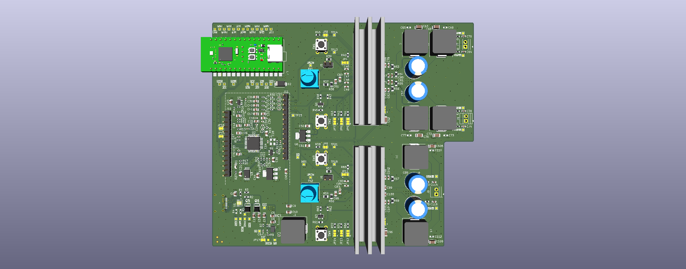
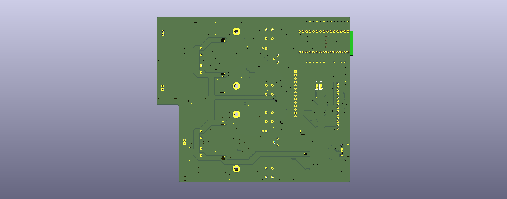
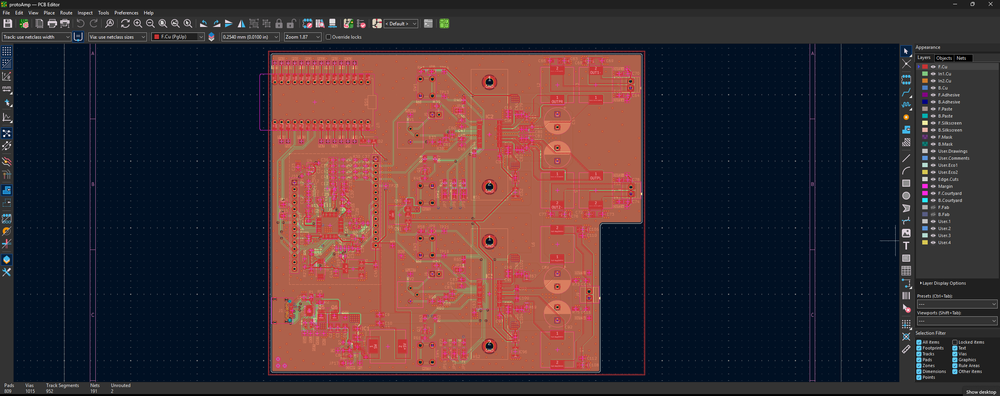
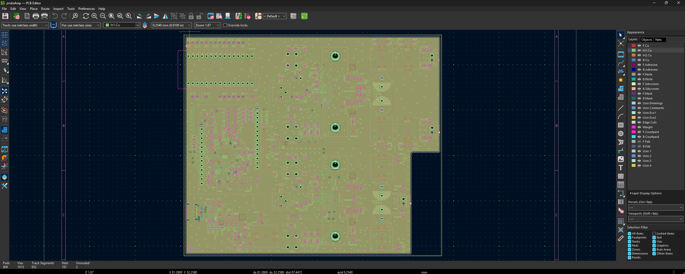
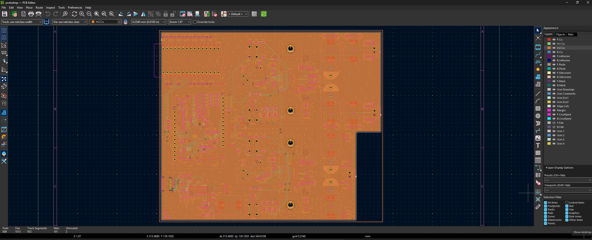
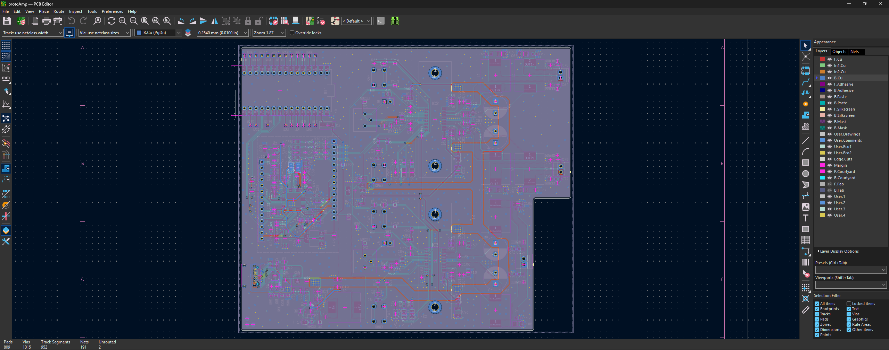

+++
title = 'Auracast Bluetooth Speaker v2'
date = 2026-08-16
summary = "More Bluetooth (hardware) shenanigans"
showSummary = true
categories = ["Post","Project",]
tags = ["bluetooth", "audio development", "product design", "consumer electronics", "speaker technology"]
+++
I've spent some time experimenting with AuraCast, and my experience has been mixed. The development boards I prototyped work well for what they're designed to do, but the lack of Bluetooth Classic support has always bothered me. Usually, I use ready-made amplifier modules for my projects, but this time I wanted to push myself and learn more about audio electronics. 


This project had two main goals: finding a simple way to draw 100W from a USB PD supply and streaming music from one source to several synchronised speakers. My ultimate goal is to turn this whole-house audio prototype into a proper plate amplifier that I can attach to my current speakers or use for future custom builds, like horn enclosures and small speaker setups. Of course, every project starts with a single prototype.

## Negotiating Power

The whole setup runs on standard USB-C, drawing 20 volts at up to 5 amps. The [HUSB238](https://en.hynetek.com/2421.html) chip handles the initial USB PD negotiation automatically, and by default, it supplies 20 volts at 3 amps (60 watts) in the schematic. To get the full 100 watts and draw 20 volts at 5 amps, you have to program the chip through an I2C port connected to the MCU. For the power input, I started with the usual [Adafruit](https://learn.adafruit.com/adafruit-husb238-usb-type-c-power-delivery-breakout/overview) schematic but made it better by using two MOSFETs instead of one for reverse-voltage protection.


## Power Sequencing and Regulation

When you first plug in a USB-C cable, the HUSB238 steps through the voltage levels the plug can deliver (9V, 12V, 15V, and 20V) to try and output whatever you, the designer, programmed it to do. To avoid any odd issues, I used an [AP63357](https://www.diodes.com/part/view/AP63357) switching IC for the 5V supply because it works safely from 3.8V to 32V. The feedback circuit sets the under-voltage lockout (UVLO) between about 16V and 18V, so the board only powers up with the right sequencing once the supply reaches at least 16V. After that, a standard Low Dropout (LDO) regulator brings the 5V down to 3.3V for the digital parts. Another LDO drops the 20V VDD to 12V to give an external analogue voltage reference for the amplifiers, which I can use if the internal reference isn't enough.

## The MCU

I picked the [STM32WBA65](https://www.st.com/en/microcontrollers-microprocessors/stm32wba65ri.html) as the main part of the system because it supports AuraCast, letting one source broadcast to many audio sinks in perfect sync. To avoid designing the MCU support circuit from scratch, I used a [WeAct Studio](https://github.com/WeActStudio/WeActStudio.STM32WBA6xCxCoreBoard/tree/master) prototyping board from [AliExpress](https://www.aliexpress.com/item/1005012497198154.html?spm=a2g0o.productlist.main.1.435fAi2pAi2pqt&algo_pvid=5d64c660-aa55-44a4-9fad-d374a7613b12&pdp_ext_f=%7B%22order%22%3A%2223%22%2C%22eval%22%3A%221%22%2C%22fromPage%22%3A%22search%22%7D&utparam-url=scene%3Asearch%7Cquery_from%3A%7Cx_object_id%3A1005012497198154%7C_p_origin_prod%3A). I made a custom footprint in KiCad so each pin can connect to its own test point, which will make the inevitable botches easier later. I also added a blocking diode on the 5V input to prevent problems between the board's switching regulator and my computer's USB port when programming the MCU.


## DSP Quirks

The MCU sends digital audio out through I2S, which goes straight into an [ADAU1701](https://www.analog.com/en/products/adau1701.html) DSP. I chose this chip because it's well documented, has the [Sigma Studio](https://www.analog.com/en/resources/evaluation-hardware-and-software/embedded-development-software/ss_sigst_02.html) GUI for programming, and cheap development boards are easy to find. Instead of starting from scratch, I reverse-engineered a development board schematic from [AliExpress](https://www.aliexpress.com/item/1005006502272969.html?spm=a2g0o.productlist.main.2.1a00gETlgETlpo&algo_pvid=c5d65702-4e28-4e2d-ac5d-9e6b8e4ce1e2&pdp_ext_f=%7B%22order%22%3A%22131%22%2C%22spu_best_type%22%3A%22price%22%2C%22eval%22%3A%221%22%2C%22fromPage%22%3A%22search%22%7D&utparam-url=scene%3Asearch%7Cquery_from%3A%7Cx_object_id%3A1005006502272969%7C_p_origin_prod%3A) and copied its layout into my design. This way, you can skip adding the DSP components and just solder a pre-made development board onto the main PCB. One thing to note about the ADAU1701: if you set it as an I2S slave, you get clock sync problems and audio glitches. To fix this, I hardwired it as a master device (by setting PLL0=0 and PLL1=1 for a 256x master clock), but I also added jumpers for flexibility.


## The Amplification Stage

The DSP acts as an active crossover, splitting the audio into four single-ended outputs and sending them to two [TPA3126D2](https://www.ti.com/product/TPA3126D2) (50W + 50W) stereo amplifiers. One amp powers the tweeter and midrange woofer, while the other runs in Bridged Tied Load (BTL) mode to combine both channels into a single 100W mono subwoofer output. Even though the two chips could deliver 200W, the USB PD only allows for 100W. If you push the chips to their max, Total Harmonic Distortion (THD) goes up a lot, so it's important to limit their output for clean sound. To keep things safe, I added a power-limiting circuit with trim pots and bridgeable jumpers (J5 and J6) to physically cap the maximum current. For the layout, I reverse-engineered the footprint from TI's development kit to include their custom heatsink design directly in KiCad.




The board has four layers: the two inner copper layers are continuous ground planes, while the top and bottom layers handle signal routing and provide large copper areas for 20V VDD power distribution. After passing through the passive LC filters at the output, the signal is ready to connect to the speaker terminals.


  
  
  
  
  
  

